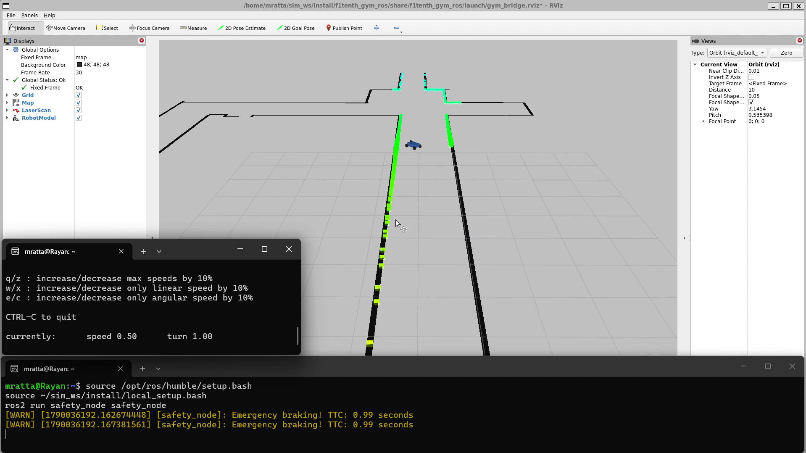

# RoboRacer Automatic Emergency Braking

A ROS 2 Humble C++ safety node that uses simulated LiDAR and odometry data to estimate time to collision and stop a RoboRacer vehicle before impact.



## What the node does

1. Subscribes to `/ego_racecar/odom` to read the vehicle's forward speed.
2. Subscribes to `/scan` to receive LiDAR range measurements.
3. Calculates the closing speed for each LiDAR beam using the beam angle.
4. Estimates time to collision with `TTC = distance / closing speed`.
5. Publishes a zero-speed Ackermann command to `/drive` when the minimum TTC is below one second.

## System

- Ubuntu 22.04 on WSL 2
- ROS 2 Humble
- C++
- F1TENTH Gym ROS simulator
- RViz
- `colcon`

## Build

Place this package inside the `src` directory of a ROS 2 workspace, then run:

```bash
source /opt/ros/humble/setup.bash
cd ~/sim_ws
colcon build --symlink-install --packages-select safety_node
source install/local_setup.bash
```

## Run

Launch the F1TENTH simulator in one terminal:

```bash
source /opt/ros/humble/setup.bash
source ~/sim_ws/install/local_setup.bash
ros2 launch f1tenth_gym_ros gym_bridge_launch.py
```

Run the safety node in a second terminal:

```bash
source /opt/ros/humble/setup.bash
source ~/sim_ws/install/local_setup.bash
ros2 run safety_node safety_node
```

Run keyboard control in a third terminal:

```bash
source /opt/ros/humble/setup.bash
source ~/sim_ws/install/local_setup.bash
ros2 run teleop_twist_keyboard teleop_twist_keyboard
```

## Result

The simulated vehicle drives normally when the path is clear. When the calculated TTC falls below one second, the node publishes a zero-speed command and reports `Emergency braking!` in the terminal. A short demonstration is included in [`media/emergency_braking_demo.mp4`](media/emergency_braking_demo.mp4).

## Key learning

This project introduced me to ROS 2 nodes, topics, publishers and subscribers; sensor-message processing; C++ robotics development; command-line builds; and simulator-based validation.
